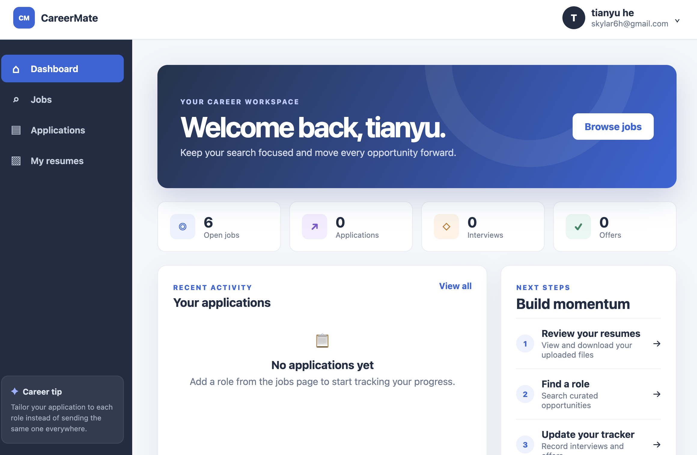

# CareerMate



CareerMate is a job application tracker built with React and Redux Toolkit. Authentication and resumes are served by a real Express/MongoDB API: [careermate-api](https://github.com/skylar-he-au/careermate-api).

Users can register, sign in, browse jobs, track their applications, and page through and download the resumes they have uploaded.

## Tech stack

- React 19
- React Router 7
- Redux Toolkit (with React Redux)
- Axios
- Sass
- Jest + React Testing Library (via `react-scripts`)

## Getting started

Copy the example environment file:

```bash
cp .env.example .env.development.local
```

Set `REACT_APP_BASE_API` to the address of your running careermate-api instance. The example values are:

| Variable | Example | Purpose |
| --- | --- | --- |
| `PORT` | `3008` | Port for the React dev server |
| `REACT_APP_BASE_API` | `http://localhost:3000` | Backend base URL (careermate-api listens on `3000` by default) |
| `REACT_APP_USE_MOCK_RESUMES` | `false` | Set to `true` in development to page through 10 local sample resumes instead of calling the API |

Install dependencies and start the dev server:

```bash
npm install
npm start
```

The app opens at <http://localhost:3008> and talks to the backend at <http://localhost:3000>. Start careermate-api first; if `REACT_APP_BASE_API` is empty, every API request is rejected before it is sent.

Run the tests once, without watch mode:

```bash
npm test -- --watchAll=false
```

Create a production build:

```bash
npm run build
```

## How it is put together

### One API client

All HTTP traffic goes through a single Axios instance in `src/services/apiClient.js`. It owns the base URL, a 15-second timeout, attaching the JWT as `Authorization: Bearer …`, and handling `401` responses. On a `401` it clears the stored session and calls the registered unauthorized handler, so no component has to detect or clean up an expired session itself.

### Injecting the unauthorized handler

`apiClient.js` exports `setUnauthorizedHandler`, and `src/index.js` registers the handler at startup. The handler dispatches `clearAuth()` and sends the browser to `/login` with `window.location.assign`.

The client does not import the store directly because that would create a circular import: `store.js` → `authSlice.js` → `authApi.js` → `apiClient.js`. With the handler injected, `apiClient.js` depends only on `authStorage.js`.

### One error shape

The response interceptor turns every failure into a plain `Error`. Its `message` is the server's `message` field when there is one, then Axios's own message, then a generic fallback. Callers never need to inspect `error.response`. The trade-off is that the HTTP status code is not kept on the error. The async thunks store `error.message` in their slice as a string.

### Resume ownership and downloads

The frontend never sends a user ID. `GET /v1/resumes` sends only `page` and `limit`, and the backend reads the owner from the JWT. To download a file, the page requests `GET /v1/resumes/:id/download`, which returns a short-lived presigned S3 URL. The browser then opens that URL.

### Side effects stay out of reducers

Every reducer is a pure function; none of them reads or writes `localStorage`.

- **Application tracker:** persisted by Redux listener middleware in `src/store/store.js`. On `loginUser.fulfilled` it loads that user's saved applications. On `clearAuth` it resets the tracker. After an application is added, updated, or removed, it saves the list under `careermate.applications.<userId>`.
- **Auth session:** saved in the `loginUser` thunk and cleared in `logoutUser` or by the API client on a `401`.

### Store factory

The store is created by `makeStore(preloadedState)`. Each call builds its own listener middleware and store, which is what lets every test start with its own clean store and chosen initial state. If no `career` state is passed in, the factory loads the tracker from `localStorage` for the current user. The app itself uses a single default instance.

One caveat: the auth slice reads its initial `user` and `token` from `localStorage` once, when the module is first imported, not on each `makeStore` call.

### Loading, error and empty states

The resumes page handles each state separately:

- **Loading:** a `role="status"` message, shown only when there are no rows yet.
- **Failed:** the error message plus a "Try again" button.
- **Empty:** a "No resumes yet" message.

When you change pages, the current rows stay on screen. The list is marked `aria-busy` and the pagination controls are disabled until the new page arrives.

### Pagination

If there are 7 pages or fewer, every page number is shown. With more pages, the control shows the first page, the last page, and the pages on either side of the current one. Gaps are collapsed into an ellipsis that is hidden from screen readers. The current page button has `aria-current="page"`, and the resume list has `aria-busy` while a page is loading.

## Tests

`src/App.test.js` renders the whole app with a fresh `makeStore(...)` store in each test. It mocks `authApi` and `resumeApi` at the module level, so the tests exercise the Redux, routing, and UI layers without touching Axios or the network. It covers these paths:

1. **Route guard:** a signed-out visit to `/home` redirects to the sign-in page.
2. **Sign-in:** submitting the login form calls the API with the entered credentials, lands on the dashboard ("Welcome back, Alex"), and saves the JWT under `careermate.auth`.
3. **Application tracker:** a signed-in user adds a job from `/jobs`, moves to Applications, changes the status to "Interview", and removes the application. The test checks `localStorage` after each step and ends on the empty tracker state.
4. **Resume pagination:** with a page size of 5 and 10 resumes, page 1 loads with `aria-current="page"`. Clicking "Page 2" requests `{ page: 2, pageSize: 5 }`, and changing rows per page to 20 requests page 1 again.
5. **TextInput:** an invalid field has `aria-invalid="true"`, shows its error message, and reports changes.

`src/utils/validators.test.js` separately covers the login and registration form validators.

These tests do not cover the API client itself (JWT injection, `401` handling, error normalisation), registration, resume downloads, the resumes page's loading, error and empty states, the pagination ellipsis, or returning to the originally requested page after sign-in.

## Known limits

- **Job listings:** fixture data hard-coded in `src/data/jobs.js`.
- **Application tracker:** stored only in the browser's `localStorage`, keyed by user ID. It is never sent to the backend.
- **JWT storage:** kept in `localStorage`. This accepts exposure to XSS in exchange for not handling CSRF or cross-origin cookie configuration. An httpOnly cookie makes the opposite trade-off.
- **Expired sessions:** a `401` signs the user out immediately with a full page redirect to `/login`. There is no refresh-token flow.
